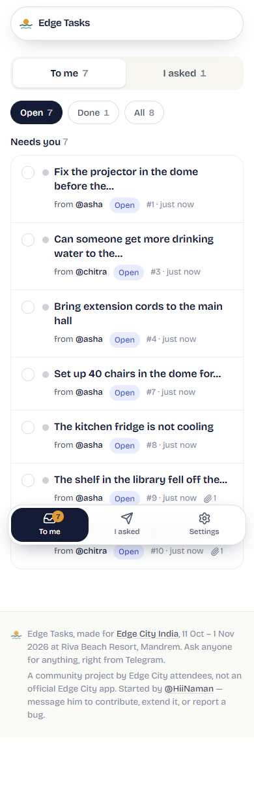
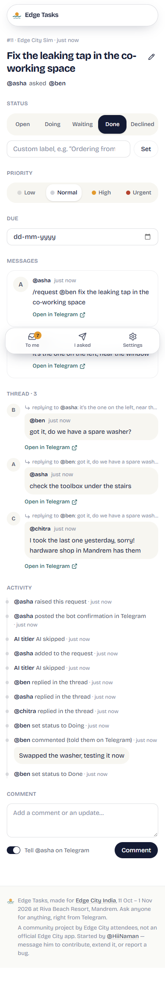


# Edge Tasks Manager

A Telegram-first task sheet for Edge City India (Mandrem, Goa, 11 Oct – 1 Nov 2026). Anyone can ask anyone for
something from any Telegram group the bot is in. Each person gets a simple web dashboard: **To me** (inbox) and
**I asked** (raised). AI assistants can read and update requests over MCP.

Community project, not an official Edge City app. The spec is [docs/SPEC.md](docs/SPEC.md).

| Inbox | Request with its reply thread | Landing |
| --- | --- | --- |
|  |  |  |

More in [docs/screenshots/final/](docs/screenshots/final/) (390px and 1280px).

## Bot commands

<!-- commands:start -->
| You type | What happens |
| --- | --- |
| `/request @bob <what>` | Ask @bob for something. Without an @name it goes to the organiser. The bot confirms with “📝 #12 for @bob”. |
| `@EdgeTasksBot @bob <what>` | Same as /request. The bot mention must be the first thing in the message; a “thanks @EdgeTasksBot” later in a sentence does nothing. |
| `@EdgeTasksBot @bob (no text)` | The bot asks “What should @bob do? Reply to this message with the details.” Your reply becomes the request. Expires in an hour. |
| `Reply + /request` | Turns their message into a request from them to you. Add @bob to hand it to bob; extra text becomes a note. Photos come along. |
| `/append (/add, /more)` | Reply to a message to add it to that person's latest open request. /append 12 picks a request. Replying to the bot's “#12” message, /append &lt;text> adds the text. The only way to change what was asked; plain replies go to the thread. |
| `/log` | Quiet. Reply to someone's message: already a request, it tells you its number; a reply to a request's message, it joins that thread; anything else becomes a request from them to you. Nothing is posted in the group and nobody is pinged: your /log is deleted (if the bot is a group admin) and only you get a DM. Later updates notify as usual. |
| `/new_request, /new_request_for_me` | Quiet versions of /request: same rules, but no group reply and no DM to anyone at creation, only a DM to you. /new_request_for_me always gives it to you, even with an @name in the note. |
| `Forward to the bot` | Forward any message to the bot in private: it shows who it's from and asks “new request, or add to one?”, listing your open requests with that person first. A new one is a quiet request from its author to you. Handy for messages /log can't see (sent before the bot joined a group, or in another chat). If the author hides forwards, you're the requester and their name starts the text. |
| `/doing` | Mark Doing. Reply to any message of the request (no id needed), or give the id. “@EdgeTasksBot on it” does the same. |
| `/waiting <reason>` | Mark Waiting; the reason becomes the label people see. |
| `/done <note>` | Mark Done; the requester is told. Reply in the thread, or /done 12 &lt;note> from anywhere. The note is the deliverable; send it with a photo or file, or reply to one, and that message is delivered too. The requester or an admin can close it on the assignee's behalf; then the assignee is told. |
| `@EdgeTasksBot done <note>` | Same as /done, by mention. “@EdgeTasksBot on it” is /doing. |
| `done (plain reply)` | Just a thread message; people say “done” in conversation. If the assignee replies exactly “done” or “✅”, the bot offers a one-tap “Mark #12 done?” button. |
| `/decline <reason>` | Say no, with a reason. The requester is told (or the assignee, if the requester declines it for them). |
| `/reopen` | Back to Open. Clears the ✅ Delivered card; the old messages stay in the thread. |
| `/mine` | Open requests for you: Act, then New, then Upcoming. Max 10. |
| `/raised` | Open requests you asked for, overdue first. |
| `/with @bob` | Everything open between you and @bob, in two blocks: what @bob asked you, then what you asked @bob. |
| `/status 12` | One request: title, status, due, who asked whom. |
| `/help` | This list, inside Telegram. |
| `/start` | Message the bot once so it can message you back. Also finishes a web login. |
<!-- commands:end -->

Generated from `src/lib/tutorial-content.ts` (also the landing tutorial and the bot's /help): edit
there, then run `node scripts/readme-commands.mjs`.

### Reply threads

Any reply, at any depth, to a message tied to a request joins that request's thread on the web: the original
message, the command, an appended message, the bot's confirmation, or a message already in the thread. No command
needed. The request page shows the thread as a flat chat with a "↳ replying to @ben: …" quote on each message and an
"Open in Telegram" link. Thread replies don't ping anyone on Telegram.

Telegram only delivers plain replies between people to a bot whose **privacy mode is off** (or which is a group
admin). In BotFather: `/setprivacy` → pick the bot → **Disable**. Do this before adding the bot to groups (or
re-add it afterwards). Commands, mentions and replies to the bot's own messages work either way. The bot warns the
superadmin when it joins a group where it can't read messages.

## Setup

1. **Neon**: create a project and a `dev` branch. Put the dev branch URL in `DATABASE_URL` and main in
   `DATABASE_URL_PROD` in `.env.local` (copy [.env.example](.env.example)). Then `pnpm install` and `pnpm db:push`
   (and `pnpm db:push:prod` for production).
2. **BotFather**: `/newbot`, copy the token into `TELEGRAM_BOT_TOKEN`, set `TELEGRAM_BOT_USERNAME` and
   `NEXT_PUBLIC_TELEGRAM_BOT_USERNAME`. Then `/setprivacy` → **Disable** (see above).
3. **Env**: fill in `.env.local`. `SESSION_SECRET` and `TELEGRAM_WEBHOOK_SECRET` are long random strings
   (`openssl rand -hex 32`). `SUPERADMIN_USERNAME` is the organiser; set `SUPERADMIN_TELEGRAM_ID` too, because a
   numeric id can't be re-claimed like a username. `OPENROUTER_API_KEY` is optional (without it, titles come from the
   first words of the message).
4. **Vercel**: import the repo, add the same env vars (production `DATABASE_URL` = Neon main), set
   `NEXT_PUBLIC_SITE_URL` to the site URL, and deploy.
5. **Webhook**: `pnpm bot:setup https://<your-site>` points the bot at `/api/telegram` and sets its commands. Safe to
   re-run.

Local development uses the Docker Postgres on `localhost:5545`, never Neon. See [docs/DEV.md](docs/DEV.md). With no
bot token, outgoing messages go to `$TMP/edge-tasks-outbox.jsonl` instead of Telegram.

## Tests

```sh
pnpm test-db     # (re)create the local Postgres container etm-test-pg on :5545, if it's missing
pnpm test        # unit + DB tests (vitest, parallel; each worker gets its own clone of a template database)
pnpm typecheck && pnpm lint
pnpm e2e         # end to end, about 25s (SHOTS=1 pnpm e2e also saves docs/screenshots/final/)
```

`pnpm e2e` (`scripts/e2e.mjs`) makes a fresh local database `etm_e2e`, starts `next dev` on :3400 with no bot token
and no AI key, and drives the bot with `scripts/sim-webhook.mjs` scenarios (request, reply-request, mention,
mention-pending, append, photo, thread-chain). Then in Chrome (Playwright) it logs in as the assignee, opens the
request from the inbox, checks the thread and its reply quotes, sets Doing, comments, and marks it done. It checks
the requester's I asked page, the requester's notification in the dev outbox, the audit rows, `/admin/activity`, and
MCP `list_requests` / `get_request` with a token made on `/settings`. Needs Google Chrome installed.

## MCP (AI assistants)

Make a token on `/settings` (shown once; it acts as you). Then, for Claude Code:

```sh
claude mcp add --transport http edge-tasks https://<your-site>/api/mcp --header "Authorization: Bearer etm_…"
```

Other clients: streamable HTTP at `https://<your-site>/api/mcp` with the header `Authorization: Bearer etm_…`.
Tools: `whoami`, `list_requests`, `get_request`, `create_request`, `update_status`, `add_comment`, `set_due`,
`set_priority`. Photos come back as signed public URLs the client can fetch. claude.ai connectors need OAuth, which
the server doesn't support yet.

## Roadmap

- **R2 for photos**: copy Telegram files to Cloudflare R2 (`attachments.r2_key`) so images outlive Telegram's file
  links. The `R2_*` env vars in `.env.example` are for this and are not used yet.
- Verb-bucket grouping for the inbox, raised page, bot and MCP (SPEC "Grouping").
- Status commands from anywhere in a thread: `/doing`, `/waiting`, `/decline`, `/reopen` (SPEC "Status from anywhere
  in the thread").
- OAuth for the MCP server, so claude.ai can connect.
